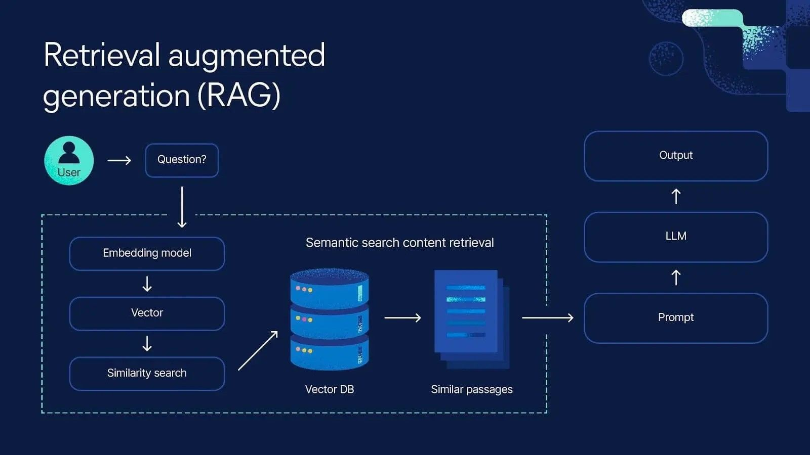
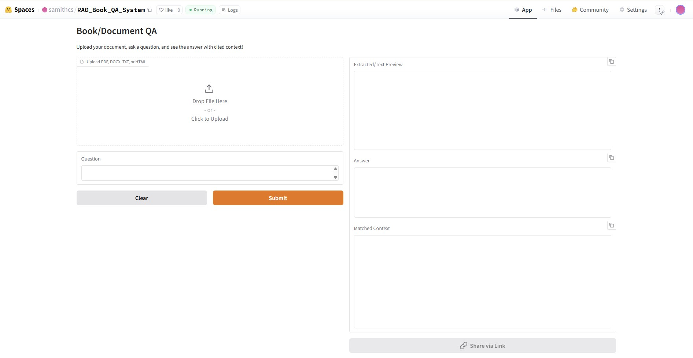

  
      


[](https://github.com/ellerbrock/open-source-badges/)

Badge [source](https://shields.io/)


# RAG_Book_QA_System
This project is an end-to-end question answering system that allows users to upload books or documents (PDF, DOCX, TXT, HTML), ask natural language questions, and receive accurate answers with cited supporting context from the uploaded materials.

Built with Gradio and Hugging Face, the solution integrates document parsing, text chunking, embeddings, vector search (FAISS), and a lightweight LLM (TinyLlama) to deliver scalable QA directly from unstructured files.

The workflow demonstrates machine learning best practices by combining automated pipelines, CI/CD for reliability, and easy deployment via Hugging Face Spaces.


Hugging Face Spaces Gradio App link : [https://huggingface.co/spaces/samithcs/RAG_Book_QA_System](https://huggingface.co/spaces/samithcs/RAG_Book_QA_System)
Docker link : [https://hub.docker.com/repository/docker/samithc/rag-book-qa](https://hub.docker.com/repository/docker/samithc/rag-book-qa)


## Authors

- [Samith Chimminiyan](https://www.github.com/samithcsachi)

## Table of Contents

- [Authors](#Authors)
- [Table of Contents](#table-of-contents)
- [Problem Statement](#problem-statement)
- [Tech Stack](#tech-stack)
- [Supported Document Types](#supported-document-types)
- [Quick glance at the results](#Quick-glance-at-the-results)
- [Lessons learned and recommendation](#lessons-learned-and-recommendation)
- [Limitation and what can be improved](#limitation-and-what-can-be-improved)
- [Work Flows](#workflows)
- [Run Locally](#run-locally)
- [Contribution](#contribution)
- [License](#license)

## Problem Statement 

Modern documents—books, manuals, research papers, and technical guides—contain vast amounts of valuable information, but searching for specific answers or contextual knowledge within them is slow, tedious, and often inefficient using traditional keyword search or manual review.

There is a growing need for intelligent tools that can extract precise answers to natural language questions directly from user-provided materials, enabling fast, context-aware insights.

This project addresses the challenge of question answering across diverse document formats by:

Automatically parsing unstructured files (PDF, DOCX, TXT, HTML)

Segmenting and embedding textual content for semantic search

Leveraging scalable retrieval and LLMs to generate accurate, context-cited answers

The solution empowers students, researchers, professionals, and organizations to interactively query their documents and receive instant, explainable responses—making knowledge truly accessible.


## Tech Stack

- Python 
- Gradio 
- Hugging Face Transformers 
- FAISS 
- SentenceTransformers
- Docker 
- GitHub Actions
- Hugging Face Spaces
- FastAPI

## Supported Document Types

The system works with on-demand uploads. Supported formats: PDF, DOCX, TXT, HTML.

## Quick glance at the results

Gradio App in Hugging Face Space 




## Lessons learned and recommendation

### Lessons Learned:

- Implemented a scalable, modular QA pipeline combining document ingestion, semantic chunking, embeddings, and retrieval-augmented LLMs.

- Integration with Hugging Face Spaces enables hassle-free cloud sharing, but required careful management of memory and file size limitations.

- Encountered file format edge-cases (PDF parsing, encoding issues) and addressed them with robust pre-processing.

- Embedding model choice (SentenceTransformers, TinyLlama) substantially impacts retrieval quality and inference speed—benchmark on both accuracy and performance for your use case.

- Deployment on Spaces requires keeping dependency lists lean and minimizing build times.

### Recommendations:

- Pre-validate and clean user-uploaded files to avoid pipeline crashes on corrupt or non-standard documents.

- Choose chunk sizes and embedding strategies that balance retrieval relevance with model context window limits.

- Monitor resource usage and error logs actively, especially when running in shared/public cloud environments.

- Consider progressive enhancements: add support for more file types, GPU inference, admin monitoring, or user feedback collection as next steps.

- Document all setup and deployment steps clearly in README to facilitate rapid local and cloud onboarding.


## Limitation and what can be improved

### Current Limitations:

- File Size & Format: Large files may exceed processing/memory capacity on Hugging Face Spaces. Only PDF, DOCX, TXT, and HTML are supported; some complex or scanned (image-based) PDFs may not parse correctly.

- Model Performance: TinyLlama and similar small LLMs may struggle with advanced reasoning or highly ambiguous queries, especially for very technical or niche topics.

- Chunking Strategy: Fixed-size text chunking can split meaningful context, sometimes impacting answer quality if relevant information is spread across multiple chunks.

- Deployment Constraints: Free or public cloud deployments (e.g., Spaces) can be slow for bigger documents or under heavy load due to resource limits and cold starts.

- No User Authentication: Currently, the app is fully public, with no per-user session management, history, or upload privacy guarantees.

### What Can Be Improved:

- Dynamic Chunking: Implement smarter, context-aware chunking using sentence boundaries or topic detection.

- More Powerful Models: Allow optional use of larger LLMs (on GPU) or external APIs for users needing higher accuracy or complex reasoning.

- Expanded Format Support: Add support for additional document types (e.g., PPTX, XLSX), images with OCR, and multi-document querying.

- Scalability: Enable horizontal scaling, persistent storage of embeddings, and batch/background processing for larger workloads.

- User & Admin Features: Add user authentication, query analytics, admin dashboard, error reporting, and feedback mechanisms for continuous improvement.


## Workflows

1. Document Upload
2. Parsing
3. Chunking
4. Embedding
5. Vector Storage
6. Query Input
7. Semantic Retrieval
8. Answer Generation
9. Result Display


## Run Locally

Initialize git

```bash
git init
```

Clone the project

```bash
git clone https://github.com/samithcsachi/rag-book-qa.git
```

Open Anaconda Prompt and Change the Directory and Open VSCODE by typing code .

```bash
cd E:/rag-book-qa
```

Create a virtual environment 

```bash
python -m venv venv

```

```bash
.\venv\Scripts\activate   
```


install the requirements

```bash
pip install -r requirements.txt
```


Run the FAST API 

```bash

uvicorn app:app --host 127.0.0.1 --port 8000 --reload

```
Run the gradio app 

```bash

python run app.py
```

## Contribution

Pull requests are welcome! For major changes, please open an issue first to discuss what you would like to change or contribute.

## License

MIT License

Copyright (c) 2025 Samith Chimminiyan

Permission is hereby granted, free of charge, to any person obtaining a copy
of this software and associated documentation files (the "Software"), to deal
in the Software without restriction, including without limitation the rights
to use, copy, modify, merge, publish, distribute, sublicense, and/or sell
copies of the Software, and to permit persons to whom the Software is
furnished to do so, subject to the following conditions:

The above copyright notice and this permission notice shall be included in all
copies or substantial portions of the Software.

THE SOFTWARE IS PROVIDED "AS IS", WITHOUT WARRANTY OF ANY KIND, EXPRESS OR
IMPLIED, INCLUDING BUT NOT LIMITED TO THE WARRANTIES OF MERCHANTABILITY,
FITNESS FOR A PARTICULAR PURPOSE AND NONINFRINGEMENT. IN NO EVENT SHALL THE
AUTHORS OR COPYRIGHT HOLDERS BE LIABLE FOR ANY CLAIM, DAMAGES OR OTHER
LIABILITY, WHETHER IN AN ACTION OF CONTRACT, TORT OR OTHERWISE, ARISING FROM,
OUT OF OR IN CONNECTION WITH THE SOFTWARE OR THE USE OR OTHER DEALINGS IN THE
SOFTWARE.

Learn more about [MIT](https://choosealicense.com/licenses/mit/) license

## Contact
If you have any questions, suggestions, or collaborations in data science, feel free to reach out:
- 📧 Email: [samith.sachi@gmail.com](mailto:samith.sachi@gmail.com)
- 🔗 LinkedIn: [www.linkedin.com/in/samithchimminiyan](https://www.linkedin.com/in/samithchimminiyan)
- 🌐 Website: [www.samithc.github.io](https://samithcsachi.github.io/)


